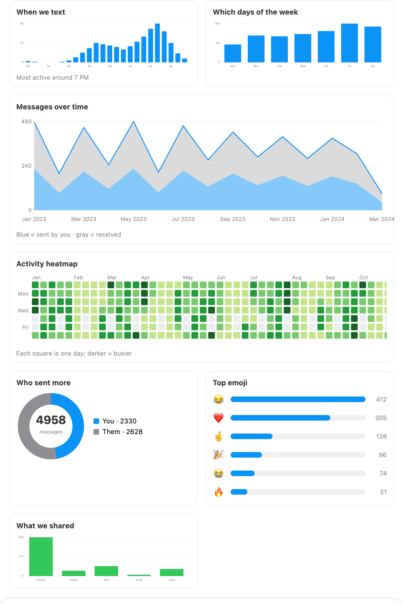
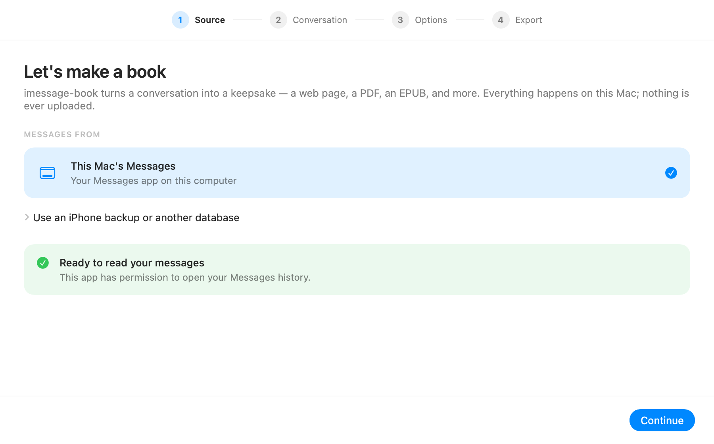
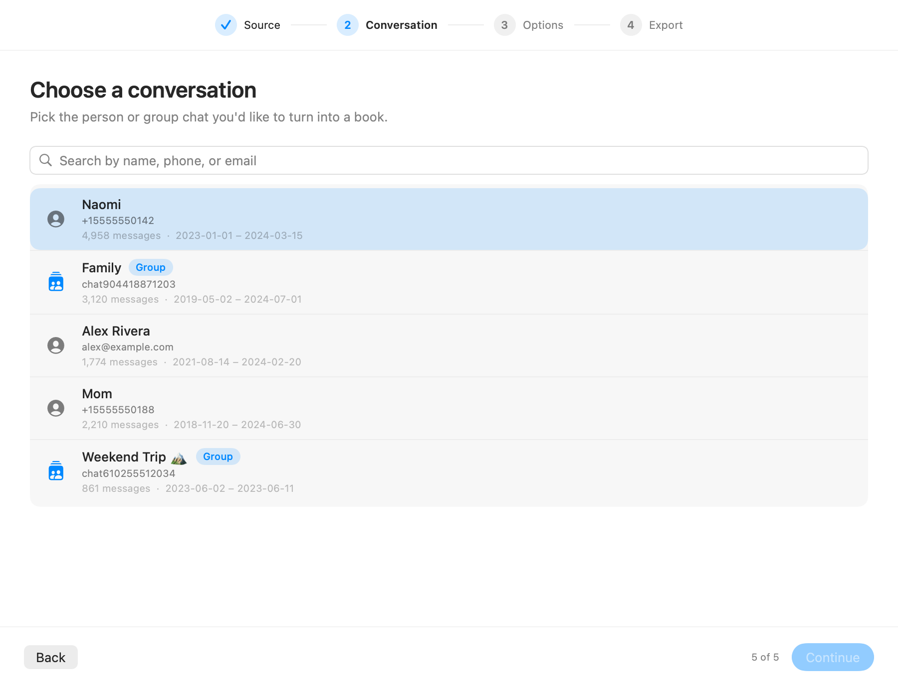
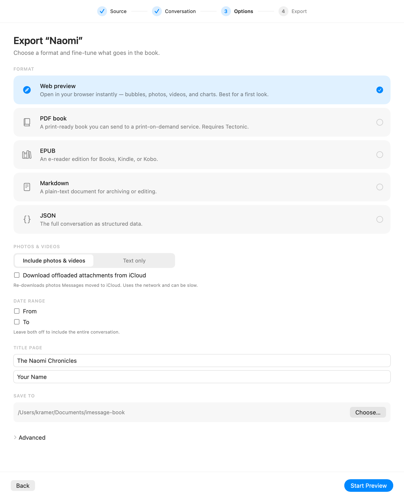
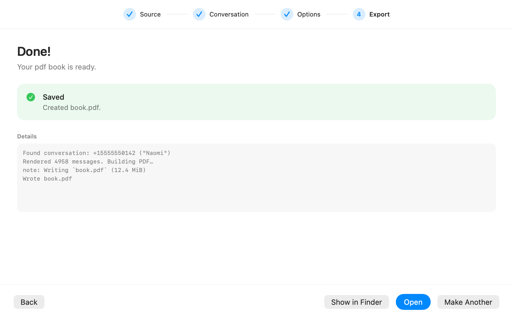

<div align="center">

# imessage-book

### Turn an iMessage conversation into a keepsake book — export your texts as a PDF, EPUB, HTML page, JSON, or Markdown.

Save, archive, and print your iMessage history with real photos, Messages-style
bubbles, a stats dashboard, and an instant browser preview — **100% offline, on your
own Mac.**

[](https://github.com/Shmoopi/imessage-book/actions/workflows/ci.yml)
[](https://github.com/Shmoopi/imessage-book/releases/latest)
[](https://github.com/Shmoopi/imessage-book/releases/latest)


</div>

`imessage-book` reads your iMessage SQLite database (a live Mac or an iOS backup),
renders the conversation as Messages-style bubbles, embeds the real photos and videos
(pulling offloaded ones back from iCloud when you ask), and hands you a finished,
print-ready book. Nothing is uploaded — every message and photo stays on your machine.

Use it however you like: a fast **command-line tool**, or a **[guided Mac app](#mac-app-no-terminal-required)**
that needs no terminal at all.


## Contents

- [Why imessage-book?](#why-imessage-book)
- [See it in action](#see-it-in-action)
- [Features](#features)
- [Install](#install)
  - [Mac app (no terminal required)](#mac-app-no-terminal-required)
- [Privacy & safety](#privacy--safety)
- [Prerequisites](#prerequisites)
- [Quick start](#quick-start)
- [Usage](#usage)
- [Configuration (`book.toml`)](#configuration-booktoml)
- [Output](#output)
- [FAQ](#faq)
- [How it works](#how-it-works)
- [Development](#development)
- [Credits & acknowledgements](#credits--acknowledgements)
- [License](#license)

## Why imessage-book?

Your most meaningful conversations are trapped inside a database you can't easily read,
search, or keep. `imessage-book` turns them into something you can hold onto:

- **A gift.** Print a year of texts with a partner, a family group chat, or a friend
  as a real book for an anniversary, wedding, or birthday.
- **A keepsake.** Preserve a conversation with someone you've lost, exactly as it was
  — bubbles, photos, and all.
- **An archive.** Export everything before you wipe or trade in a phone, migrate off
  iCloud, or just want an offline backup you actually control.
- **A record.** Produce a clean, timestamped PDF/JSON of a conversation for your own
  files or journaling.

It's a fast, single-binary command-line tool — or a one-click Mac app for non-technical
folks — with no accounts, no cloud, and no subscription.

## See it in action

Three commands take you from install to a finished book:

```console
$ imessage-book list-chats
Conversations in /Users/you/Library/Messages/chat.db (most active first):

  +15555550142 ("Naomi")  —  4958 messages, 2023-01-01 to 2024-03-15
  chat904418871203 ("Family")  —  3120 messages, 2019-05-02 to 2024-07-01
  alex@example.com ("Alex Rivera")  —  1774 messages, 2021-08-14 to 2024-02-20

$ imessage-book preview "+15555550142"
Found conversation: +15555550142 ("Naomi")
Rendered 4958 messages. Starting preview…
Preview ready at http://127.0.0.1:8000/
Press Ctrl-C to stop.

$ imessage-book build "+15555550142" --open
Found conversation: +15555550142 ("Naomi")
Rendered 4958 messages. Building PDF…
note: Writing `book.pdf` (12.4 MiB)
```

The `preview` step opens instantly (no LaTeX) to a Messages-style read of your whole
history — that's the page above. Scroll to the top and you get a **"By the numbers"
front page** and a dashboard of interactive, dependency-free charts:




Happy with it? `build` compiles the same content into a print-ready PDF (via
[Tectonic](https://tectonic-typesetting.github.io/) — no MacTeX required), or swap the
subcommand for `epub`, `json`, or `markdown`.

## Features

- **A guided Mac app — no terminal needed.** A native SwiftUI app wraps the same engine
  for non-technical users: a built-in Full Disk Access check, a searchable conversation
  picker (labeled with your **Contacts names**, not raw phone numbers), format and
  options, and a live progress view — with the engine bundled in, so there's nothing else
  to install. [See it →](#mac-app-no-terminal-required)
- **Formatting that looks like Messages.** Colored bubbles (blue / gray / SMS green),
  per-message timestamps, day separators, "… later" gap markers, group-chat sender
  names, tapbacks (including stickers), replies quoted from their parent, app/link
  balloon labels, group announcements as system lines, expressive-effect tags ("sent
  with Slam"), and an `edited` tag.
- **Real attachments, embedded — not counted.** Photos (HEIC is transcoded to JPEG),
  video poster frames, and labeled placeholders for everything else. Attachments that
  Messages offloaded to iCloud can be pulled back on demand (`--download-from-icloud`).
  Conversions run in parallel, so large books build much faster.
- **A stats dashboard.** A "By the numbers" page — message counts, per-person split,
  date span, words sent/received, photo/video/GIF/audio counts, links shared, typical
  reply time, busiest day, busiest hour, longest daily streak, and top emoji (counted
  by grapheme, so multi-codepoint emoji tally correctly). The HTML preview adds inline
  SVG charts drawn offline (no CDN): a histogram of *when* you text, a weekday
  breakdown, a message-volume trend, a GitHub-style activity heatmap, a who-sent-more
  donut, top-emoji bars, and an attachment breakdown — all with hover tooltips.
- **Five output formats from one model.** An instant HTML **preview**, a print-ready
  **PDF**, an **EPUB** for e-readers, plus **JSON** and **Markdown** for archival and
  interop.
- **A preview you can actually use.** Live search, a chapter table-of-contents sidebar,
  clickable links (URLs and emails), a click-to-zoom image lightbox (keyboard/arrow
  navigation), actually-playable videos (served with HTTP range support so they stream
  and seek), and animated GIFs.
- **Privacy controls.** Omit specific people, mask sensitive words, or drop all
  attachments via `book.toml`'s `[privacy]` section.
- **Cross-platform reads.** Builds and runs on Linux/Windows for iOS-backup exports
  (the iCloud-materialization path is macOS-only).
- **Themeable and print-ready.** Configurable bubble colors, fonts, cover image, and
  page-size / margin presets (letter, A4, 6×9, …) for print-on-demand, plus an optional
  photo-gallery appendix.
- **Automatic contact names.** Group-chat participants are named from your macOS
  Contacts (AddressBook), overridable per-handle in `book.toml`.
- **Self-contained PDF builds.** Uses [Tectonic](https://tectonic-typesetting.github.io/)
  by default, so you don't need a full MacTeX install.
- **Configurable via `book.toml`.** Title, author, dedication, contact names, and emoji
  font — instead of editing templates by hand.

## Install

### Mac app (no terminal required)

<div align="center">

</div>

Prefer clicking to typing? There's a native macOS app that wraps the same engine in a
guided, four-step flow — pick a conversation, choose a format, and export — with a
built-in Full Disk Access check and a live progress view. It bundles the engine, so
there's nothing else to install (except [Tectonic](https://tectonic-typesetting.github.io/)
if you want PDFs). Conversations are labeled with your **Contacts names**, not raw phone
numbers.

**Download:** grab the `imessage-book-<version>-macos.dmg` from the
[latest release](https://github.com/Shmoopi/imessage-book/releases/latest), open it, and
drag **imessage-book** into your Applications folder, then launch it. Notarized releases
open straight away; if macOS shows a Gatekeeper warning (e.g. an un-notarized build),
right-click the app and choose **Open** instead. (A `.zip` is attached too if you'd rather
not use the disk image.)

|  |  |
|:--:|:--:|
|  |  |
| **1 · Source** — pick this Mac (or an iPhone backup) | **2 · Conversation** — search by contact name |
|  |  |
| **3 · Options** — format, photos, date range, title | **4 · Export** — watch it build, then open |

**Or build it from source** (requires the Rust toolchain and Xcode command-line tools):

```sh
scripts/build-app.sh --open   # produces dist/ImessageBook.app and launches it
```

See [`macos-app/README.md`](macos-app/README.md) for details, development tips, and
distribution signing. The rest of this README covers the command-line tool the app is
built on.

### Homebrew (macOS)

```sh
brew tap Shmoopi/imessage-book https://github.com/Shmoopi/imessage-book
brew install imessage-book
```

This drops a prebuilt binary (native Apple Silicon and Intel builds) on your `PATH` as
`imessage-book`. Upgrade later with `brew upgrade imessage-book`. The formula lives in
this repo at [`Formula/imessage-book.rb`](Formula/imessage-book.rb) and is refreshed
automatically on every release, so `brew upgrade` always tracks the latest version.

### From source

With a stable Rust toolchain (this is also the path for reading iOS backups on
Linux/Windows):

```sh
git clone https://github.com/Shmoopi/imessage-book
cd imessage-book
cargo install --path .        # installs `imessage-book` into ~/.cargo/bin
# or `cargo build --release`  # leaves the binary at target/release/imessage-book
```

## Privacy & safety

`imessage-book` is built to be trustworthy with the most personal data you have:

- **Fully offline.** It never sends your messages, photos, or contacts anywhere. There
  are no analytics, no accounts, and no network calls — except the one you explicitly
  opt into with `--download-from-icloud`, which asks macOS to re-download attachments
  *you already own* from iCloud.
- **Read-only.** It opens your `chat.db` read-only and only ever *reads* your messages.
  Output is written to a separate `output/` directory; your Messages history is never
  modified.
- **Yours to redact.** The `[privacy]` section of `book.toml` lets you exclude specific
  people, mask sensitive words, or drop every attachment before a single page is
  rendered — handy before sharing or printing.
- **Open source.** Every line that touches your data is right here to read.

## Prerequisites

> **Using the [Mac app](#mac-app-no-terminal-required)?** It bundles the engine and walks
> you through Full Disk Access, so you can skip the Rust and terminal steps below — you
> only need [Tectonic](https://tectonic-typesetting.github.io/) if you want PDF output.

- **macOS** for the live database (`~/Library/Messages/chat.db`). iOS-backup exports
  also work on Linux/Windows from source.
- **Rust** (stable) — only needed to build from source; `brew install` ships a
  prebuilt binary.
- **Full Disk Access** for your terminal to read `~/Library/Messages/chat.db`
  (System Settings → Privacy & Security → Full Disk Access). The tool tells you if
  this is missing.
- **For PDF output:** [`tectonic`](https://tectonic-typesetting.github.io/) —
  `brew install tectonic` (recommended). A system `latexmk`/`xelatex` also works with
  `--engine system`.
- **For attachments:** `sips` (built into macOS, used for HEIC→JPEG). `ffmpeg`
  (optional, `brew install ffmpeg`) enables video poster frames.

## Quick start

```sh
# 0. (Optional) scaffold a book.toml you can edit.
imessage-book init

# 1. Find the conversation you want (phone, email, or group name).
imessage-book list-chats

# 2. Preview it in the browser (fast; no LaTeX). Great for iterating.
imessage-book preview "+15555555555" --limit 300

# 3. Build the PDF book.
imessage-book build "+15555555555" --open
```

> Building from source instead of installing? Prefix each command with
> `cargo run --release --`, e.g. `cargo run --release -- list-chats`.

## Usage

The export subcommands share the same database-location, subset, and attachment
options:

```
imessage-book init                            # write a starter book.toml
imessage-book list-chats [--json]             # conversations (add --json for scripting)
imessage-book preview  <recipient> [options]  # HTML preview in the browser
imessage-book build    <recipient> [options]  # PDF book (via Tectonic)
imessage-book epub     <recipient> [options]  # EPUB for e-readers
imessage-book json     <recipient> [options]  # single JSON document
imessage-book markdown <recipient> [options]  # Markdown document (alias: md)
```

`<recipient>` matches a chat by phone number, email, or (for groups) display name.

`--config <path>` (available on every subcommand) points at a specific `book.toml`
instead of auto-discovering one in the current directory.

### Database location

- Default: the live Mac database at `~/Library/Messages/chat.db`.
- `--ios-backup-dir <DIR>`: the root of an unencrypted iOS backup.
- `--chat-database <FILE>`: a `chat.db` directly.

### Attachments

- `--attachments media` (default) embeds photos and video poster frames;
  `--attachments none` renders labeled placeholders only.
- `--download-from-icloud` materializes offloaded attachments via `brctl`
  (macOS live database only; hits the network).
- `--max-attachment-mb <N>` skips embedding files larger than N MB.

### Subsetting (for fast iteration or excerpts)

- `--limit <N>` — first N messages.
- `--from <YYYY-MM-DD>` / `--to <YYYY-MM-DD>` — date range.
- `--sample <N>` — evenly sample N messages across the range.

### PDF engine

- `--engine auto` (default) uses Tectonic if installed, otherwise a system TeX.
- `--engine tectonic` forces Tectonic; `--engine system` forces `latexmk`/`xelatex`.
- `--open` opens the finished PDF.

## Configuration (`book.toml`)

Create a `book.toml` in the directory you run from:

```toml
title = "The Naomben Chronicles"
author = "Your Name"
dedication = "Dedicated to you."
cover_image = "~/Pictures/cover.jpg"   # optional; shown on the title page
gallery = true                         # append a grid of every photo

# Optional. Emoji glyph font for the PDF. Note: the XeTeX/Tectonic engine renders
# emoji monochrome regardless of font; the HTML preview always shows color emoji.
emoji_font = "Noto Emoji"

# Print geometry for the PDF.
[page]
size = "6x9"        # letter | a4 | a5 | 6x9 | 5x8 | 7x10 | 8.5x11
margin_in = 0.75

# Bubble colors (hex) and main text font.
[theme]
me_color = "0B93F6"
them_color = "E5E5EA"
sms_color = "34C759"
font = "Palatino"

# Layout knobs.
[format]
gap_minutes = 60    # minimum same-day silence before a "… later" marker (< 60 enables
                    # minute-granularity markers like "20 minutes later")
chapters = "month"  # group chapters by "month" (default), "year", or "week"

# Privacy controls applied while assembling the book.
[privacy]
exclude_handles = ["+15550000000"]  # omit these people's messages entirely
redact = ["password", "SSN"]        # mask these words (case-insensitive) with █
hide_attachments = false            # drop every attachment for a text-only book

# Friendly names for group-chat participants, keyed by phone/email. These override
# names resolved automatically from your macOS Contacts.
[names]
"+15555555555" = "Naomi"
"friend@example.com" = "Alex"
```

Run `imessage-book init` to drop a fully-commented `book.toml` in the current directory.

## Output

Generated files land in `output/` (override with `--output-dir`):

- `index.html` — the preview page (served by `preview`).
- `book.tex` + `book.pdf` — the LaTeX source and compiled book (from `build`).
- `book.epub` — the e-reader edition (from `epub`).
- `book.json` — the full model as one JSON document (from `json`).
- `book.md` — the Markdown edition (from `markdown`).
- `attachments/` — converted/copied images and video frames.

## FAQ

**Do I need to install anything to use the Mac app?**
No. The [Mac app](#mac-app-no-terminal-required) bundles the engine, so downloading it is
all you need. Only PDF export needs an extra tool ([Tectonic](https://tectonic-typesetting.github.io/),
`brew install tectonic`) — every other format works out of the box.

**I downloaded the Mac app but macOS won't let me open it.**
Notarized releases open normally. If you're running a self-built copy — or a release that
wasn't notarized — Gatekeeper asks the first time: right-click the app, choose **Open**,
then **Open** again in the dialog (macOS remembers after that). If it still refuses, run
`xattr -dr com.apple.quarantine /Applications/ImessageBook.app`.

**Does imessage-book upload my messages anywhere?**
No. It runs entirely on your machine with no network calls, except the optional
`--download-from-icloud`, which asks macOS to re-download your own offloaded
attachments. See [Privacy & safety](#privacy--safety).

**Can it modify or delete my messages?**
No. The database is opened read-only; output is written to a separate directory.

**Can I export messages from my iPhone?**
Yes — point `--ios-backup-dir` at the root of an **unencrypted** iOS backup made with
Finder/iTunes. Encrypted backups aren't supported directly; make an unencrypted backup
(or decrypt it first).

**Does it work with group chats?**
Yes. Group participants are labeled, named from your macOS Contacts, and overridable in
`book.toml`.

**Does it include photos, videos, and GIFs?**
Yes. Photos are embedded (HEIC is converted to JPEG), videos get poster frames (and play
inline in the HTML preview), and GIFs animate. Use `--attachments none` for a text-only
book, or `--max-attachment-mb` to cap embedded file size.

**SMS/RCS or just iMessage?**
Anything in the Messages app, including green-bubble SMS/MMS, is included. WhatsApp,
Signal, Telegram, and Android message stores are *not* — this reads Apple's Messages
database.

**Can I run it on Windows or Linux?**
The prebuilt Homebrew binary is macOS-only. To read an **iOS backup** on Windows/Linux,
build from source (`cargo build --release`). The live-Mac and iCloud paths are
macOS-only.

**Where is the database and why do I need Full Disk Access?**
The live database is at `~/Library/Messages/chat.db`, which macOS protects. Grant your
terminal Full Disk Access under System Settings → Privacy & Security so the tool can read
it.

**My conversation is huge — will it work?**
Yes. Attachment conversion is parallelized, and you can iterate quickly with `--limit`,
`--from`/`--to`, or `--sample` before rendering the whole thing.

## How it works

```
iMessage DB ─▶ db/ (chats, messages, contacts)
            ─▶ attachments/ (resolve · iCloud materialize · HEIC/video convert)
            ─▶ assemble (month chapters · separators · tapbacks · stats · parallel convert)
            ─▶ model::BookView ─┬─▶ render::html     ─▶ preview server
                                ├─▶ render::latex    ─▶ Tectonic ─▶ PDF
                                ├─▶ render::epub     ─▶ EPUB
                                ├─▶ render::json     ─▶ JSON
                                └─▶ render::markdown ─▶ Markdown
```

Message parsing is powered by
[`imessage-database`](https://crates.io/crates/imessage-database).

The [macOS app](macos-app/) is a thin SwiftUI front end over this same engine: it shells
out to the `imessage-book` binary (bundled in the `.app`) and streams its progress, so
every format above is produced by the exact same code the CLI runs.

## Development

```sh
cargo test                                 # unit + rendering integration tests
cargo fmt --all --check                    # formatting (enforced in CI)
cargo clippy --all-targets -- -D warnings  # lints (enforced in CI)
cargo run --example sample -- sample-out   # render a synthetic book to HTML/PDF/EPUB
```

The `sample` example renders a fake conversation end-to-end without touching your
real messages — handy for working on the templates in `templates/`. The preview images
above were captured from its output. CI runs the checks above on both macOS and Linux.

The macOS GUI lives in [`macos-app/`](macos-app/) (a SwiftUI package). Build the `.app`
with `scripts/build-app.sh` (set `UNIVERSAL=0` for a fast, this-Mac-only build), or
iterate with `swift run --package-path macos-app` after a `cargo build --release`. The app
icon and the screenshots above are generated from code — see
[`macos-app/README.md`](macos-app/README.md). CI compiles the SwiftUI package and
assembles the signed `.app` on macOS for every push and PR.

## Credits & acknowledgements

`imessage-book` is based on [**message-book**](https://github.com/bkettle/message-book)
by **[Ben Kettle](https://github.com/bkettle)**, who created the original tool and its
design. Huge thanks to Ben — this project builds on that foundation. Please star and
credit the [original repository](https://github.com/bkettle/message-book) as well.

Message parsing is powered by the excellent
[`imessage-database`](https://crates.io/crates/imessage-database) crate, and PDFs are
built with [Tectonic](https://tectonic-typesetting.github.io/).

## License

This project inherits its licensing from the original
[message-book](https://github.com/bkettle/message-book) by Ben Kettle. If you plan to
redistribute, please confirm the license terms with the upstream project first.
